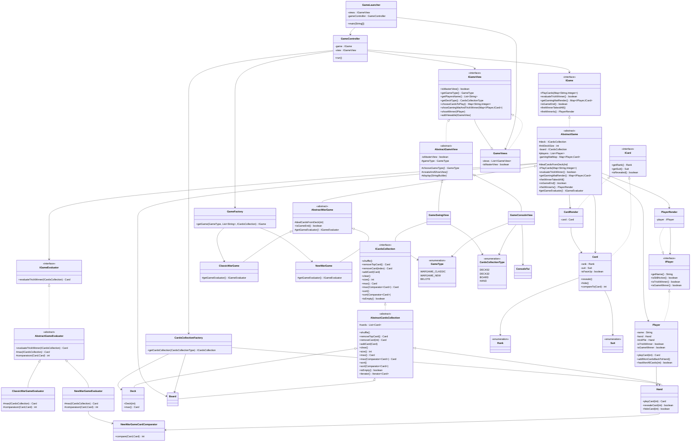
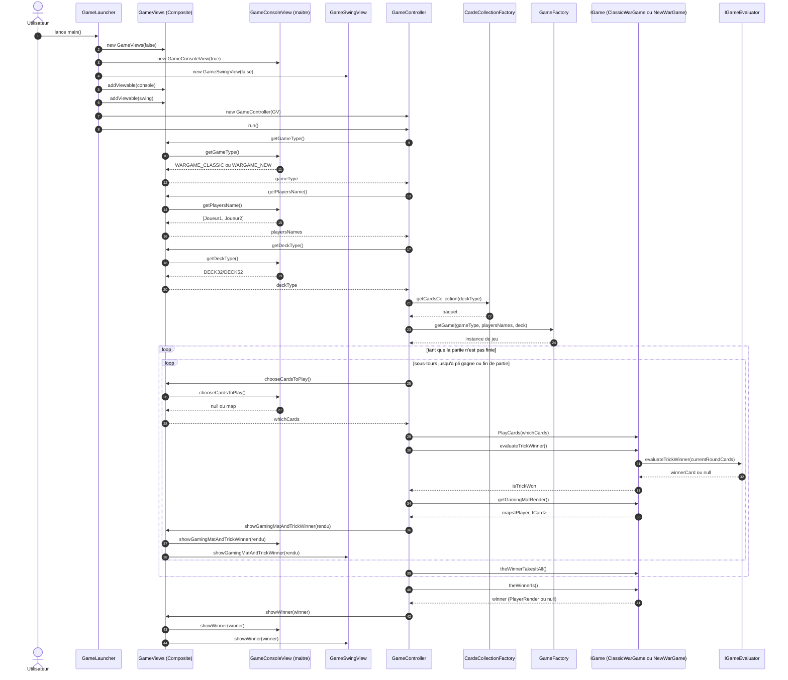
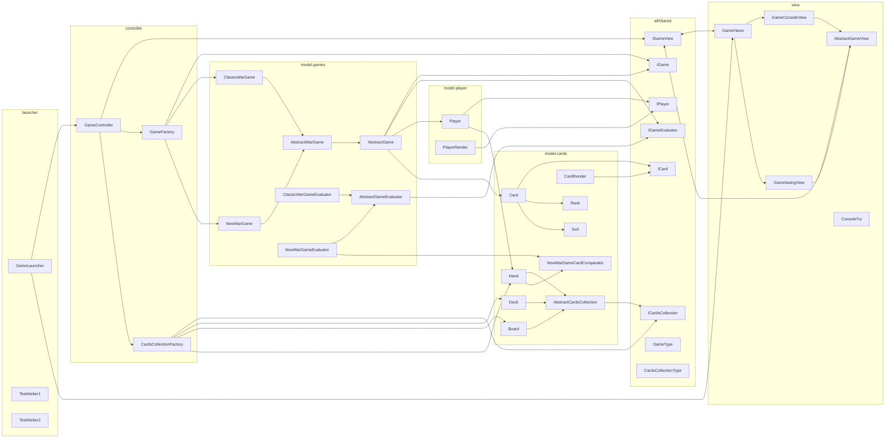

# Diagrammes d'Architecture de l'Application

Ce document contient trois diagrammes Mermaid pour l'application actuelle :

- Diagramme de classes complet
- Diagramme de sequence principal d'execution
- Diagramme de structure globale (packages/modules)

## 1. Diagramme de Classes Complet

## 2. Diagramme de Sequence Principal (GameLauncher -> Fin de Partie)

  ## 3. Diagramme de Structure (Packages et Dependances Principales)

